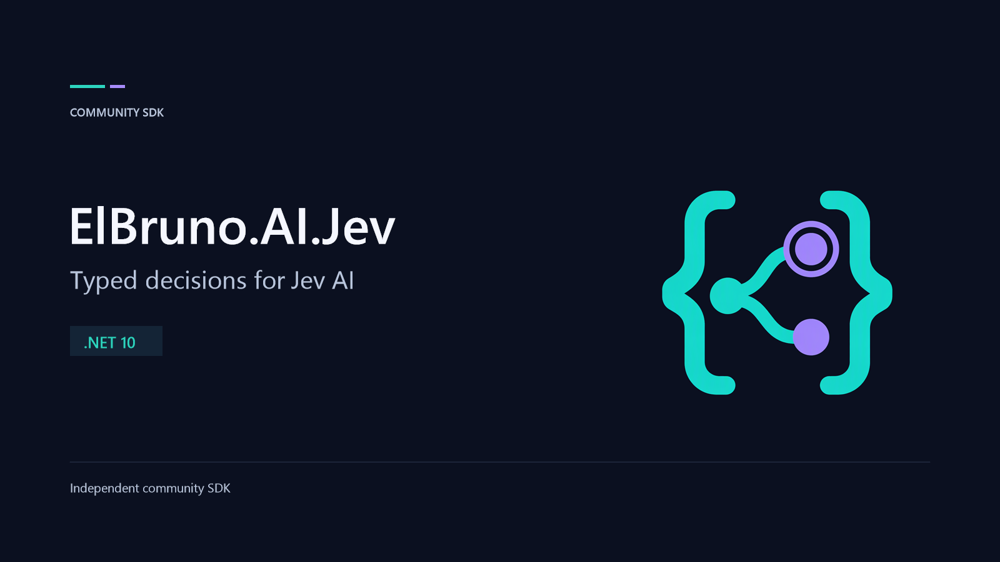

# ElBruno.AI.Jev



A community-maintained **.NET 10** client for the **official TypeSafe AI Jev API**. Evaluate **Choice**, **Score**, and **Noul** questions, preserve uncertainty, discover models, and compose decisions with **Microsoft.Extensions.AI**.

> This is not an official TypeSafe AI SDK. The provider is `https://api.typesafe.ai`, documented at [docs.typesafe.ai](https://docs.typesafe.ai/). The independent `jevtypesafeai.com` proxy has different credentials and endpoints and is not supported.

**Status:** offline-ready preview implementation. Real-service compatibility must still be verified with an official TypeSafe key before a release is published. No package publication is implied by this repository.

## Why Jev?

| Primitive | Use it for | Preserve |
| --- | --- | --- |
| Choice | Choosing among explicit labels | Winner, every option's probability, server confidence |
| Score | Evaluating an ordered 2-10 level rubric | Fractional expected rubric position, distribution, structured legend |
| Noul | Assessing whether a proposition is true | A probability in [0,1], not an automatically thresholded boolean |

Evaluate several independent questions against the same text or structured JSON state in one request. Jev is **not a text-generation or embedding model**. It has no documented native streaming, image, audio, or realtime endpoint.

## Requirements and installation

Use the **.NET 10 SDK**. The repository pins the 10.0.4xx feature band in `global.json`.

After a package is published:

```powershell
dotnet add package ElBruno.AI.Jev --prerelease
```

Until then, build and consume the local package using the [release guide](docs/releasing.md).

## First decision

```csharp
using ElBruno.AI.Jev;

// Read credentials from application configuration, not source code.
using var client = new JevClient(new JevClientOptions
{
    ApiKey = configuration["Jev:ApiKey"]
        ?? throw new InvalidOperationException("Configure Jev:ApiKey."),
    DefaultModel = JevModels.Version1_13_0
});

var category = new JevQuestionKey<JevChoiceAnswer>("category");
var request = new JevDecisionRequest("Please correct the invoice for my order.")
    .WithQuestion(category, new JevChoiceQuestion(
        "Choose the team that should handle this request.",
        new Dictionary<string, string?>
        {
            ["billing"] = "Invoices, payments, and refunds",
            ["support"] = "Technical support",
            ["other"] = "None of these teams applies"
        }));

JevDecisionResponse response = await client.EvaluateAsync(request, cancellationToken);
JevChoiceAnswer answer = response.GetAnswer(category);
Console.WriteLine($"{answer.Choice}: confidence {answer.Confidence:F3}");
```

`configuration` and `cancellationToken` come from the consuming application. The [Hello Choice sample](samples/01-HelloChoice/README.md) is a complete runnable version.

## Try the samples without credentials

```powershell
dotnet run --project samples\01-HelloChoice -- --offline
dotnet run --project samples\03-ParallelDecisions -- --offline
```

`--offline` is explicit and uses labeled, synthetic HTTP responses. It does **not** evaluate a model or demonstrate model quality. Missing live credentials never silently select offline mode.

To configure actual calls later:

```powershell
.\scripts\Set-JevUserSecrets.ps1
dotnet run --project samples\01-HelloChoice
```

The script prompts for a masked key and passes it through standard input, not command arguments. Samples and integration tests share one development `UserSecretsId`, so running it once configures all of them. **Do not paste the real key into chat or commit it.** User-secrets are outside the repository but are not an encrypted production vault. See [configuration](docs/configuration.md).

## Microsoft.Extensions.AI

This package composes Jev decisions with Microsoft's abstractions rather than pretending Jev generates chat:

| Surface | Support |
| --- | --- |
| `AIFunction` | Expose explicitly configured decision operations as tools |
| `IChatClient` routing | Select among caller-registered real chat clients |
| `DelegatingChatClient` assessments | Assess inputs or buffer and review outputs before returning them |
| Builders, function invocation, caching, telemetry | Compose with standard Microsoft.Extensions.AI middleware |
| Native chat / embeddings / image / speech / files / realtime | Not supported by the documented Jev service |

The Jev key enables decisions, not another provider's generative model. Chat integration samples use clearly labeled deterministic chat clients. See [Microsoft.Extensions.AI integration](docs/microsoft-extensions-ai.md).

## Samples

| Sample | Scenario |
| --- | --- |
| [01 Hello Choice](samples/01-HelloChoice/README.md) | Minimal classification and uncertainty |
| [02 Score and Noul](samples/02-ScoreAndNoul/README.md) | Rubric scoring versus proposition probability |
| [03 Parallel Decisions](samples/03-ParallelDecisions/README.md) | Multiple primitives against one shared state |
| [04 Structured State](samples/04-StructuredState/README.md) | Structured JSON and explicit serialization metadata |
| [05 Models and Pinning](samples/05-ModelsAndPinning/README.md) | Discovery and resolved versions |
| [06 Dependency Injection](samples/06-DependencyInjection/README.md) | Generic Host, options, HTTP ownership |
| [07 MEAI Tools](samples/07-MEAI-Tools/README.md) | A decision as an AI function |
| [08 MEAI Routing](samples/08-MEAI-Routing/README.md) | Explicit route selection |
| [09 MEAI Assessments](samples/09-MEAI-Assessments/README.md) | Input/output review semantics |
| [10 RAG Reranking](samples/10-RagReranking/README.md) | Bounded concurrent relevance assessments |

## Reliability and honest limits

- Immutable requests and owned JSON values; safe concurrent calls.
- Cancellation across HTTP, response reads, and retry waits; a total deadline.
- Default retries only for 429 and 529. Ambiguous network failures and other 5xx require explicit replay opt-in and may be billed.
- Bounded responses, per-request credentials, disabled redirects on owned/factory transports, and no automatic provider fallback.
- No keys, prompts, or error bodies in default SDK messages. Raw native data and opt-in error bodies can still be sensitive.
- Moving model aliases remain supported; pinned IDs need not appear in discovery.
- Confidence is not correctness, Noul is not severity, and assessments are **not guaranteed prompt-injection protection**.

Read [decision semantics](docs/decisions.md), [errors and retries](docs/errors-and-retries.md), and [testing](docs/testing.md).

## Development

```powershell
dotnet build ElBruno.AI.Jev.slnx -c Release
dotnet test ElBruno.AI.Jev.slnx -c Release --no-build
```

Normal tests require no Jev credentials. Live tests are separately opt-in, use synthetic inputs, and have a documented request budget.

See [contributing](CONTRIBUTING.md), [release preparation](docs/releasing.md), and [image provenance](images/README.md). Licensed under [MIT](LICENSE).
